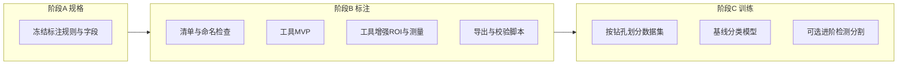

# 岩芯碎裂标注工具与训练：分步执行计划

## 目标与约束（已对齐）

- **任务**：人工标注岩芯是否「碎裂/破碎」，依据三条：（1）完整性破坏、明显裂缝；（2）断块、掉块、连续性中断；（3）碎块化/粉化、失去圆柱形态；需支持**手动修改**。
- **数据**：[`RW1/图片上`](d:/Eyu/Cursor/My project/RW1/图片上) = **上钻孔**，[`RW1/图片下`](d:/Eyu/Cursor/My project/RW1/图片下) = **下钻孔**。
- **训练侧**：按**钻孔分层**划分 train/val/test，避免同孔泄漏；导出带 `drill_hole` 元数据。

---

## 总体流水线（最终汇合点）

---

## 阶段 A：规格冻结（不写代码或只写一页说明）

**产出**：一人可执行的《标注与导出约定》半页纸（或 `RW1/README` 草案）。

| 小步骤 | 内容 | 验收 |
|--------|------|------|
| A1 | 阳性定义：三条满足**其一**即阳性，还是需多数表决；是否保留「不确定」类 | 文字一句定稿 |
| A2 | 证据是否强制 ROI：整图结论 + 可选/必选区域与「证据类型」（裂缝/断块/粉化） | 定稿 |
| A3 | 测量语义：拖拽记录**像素长度**；是否配置 `pixels_per_mm` 换算物理量 | 定稿 |
| A4 | 导出 JSON **字段表**（建议含：`image_path`, `drill_hole`, `image_label` 碎裂/未碎裂/不确定, `regions[]` 含 `evidence`, `geometry`, `measure_px`） | 示例 JSON 一条 |

---

## 阶段 B：数据与标注工具（可分三次迭代）

**产出**：可标注、可保存、可导出、可校验的数据闭环。

| 小步骤 | 内容 | 验收 |
|--------|------|------|
| B1 | **数据盘点**：扫描两文件夹，统计数量、后缀、分辨率分布；统一命名建议（不改文件也可先记下规律） | 简短表格或日志 |
| B2 | **工具 MVP**：选一种本地技术栈（推荐：**本地 Web**：浏览器 + Canvas/SVG，便于拖拽与缩放；备选：Python + PyQt/OpenCV）。功能：目录加载（或指定根目录）、显示当前钻孔、上一张/下一张、**整图三态标签**、保存到侧车 JSON | 能完整标完一张图并落盘 |
| B3 | **工具增强**：ROI（矩形或多边形任选其一先做）、每 ROI **证据类型**；**拖拽测距**（两点或多折线长度→像素和）；标签可编辑、覆盖保存 | 与 A4 字段一致 |
| B4 | **导出聚合**：将每张图旁 JSON 合并为**单一 `dataset.jsonl` 或 `annotations.json`**；提供 **校验脚本**（路径存在、`drill_hole` 与文件夹一致、必填字段齐全） | 一条命令通过校验 |

---

## 阶段 C：训练（与标注并行可延后）

**产出**：可复现实验目录 + 基线指标。

| 小步骤 | 内容 | 验收 |
|--------|------|------|
| C1 | **划分脚本**：读取导出文件，按 `drill_hole` 分层抽样 train/val/test（比例自定，如 70/15/15，且每孔非空） | 生成三个列表文件 |
| C2 | **基线分类**：整图二分类（或三分类含不确定）；小模型（如 MobileNet/EfficientNet-tiny）+ 指标 F1/召回；记录随机种子与版本 | val/test 指标可查 |
| C3 | **（可选）** 若有 ROI：弱监督或检测头；或先做 Grad-CAM 类可视化验证模型是否看裂缝区域 | 文档记录是否值得继续 |

---

## 集成方式（「分开执行再总合」）

1. **契约优先**：先完成 **A4 导出字段** → B2/B3 只实现该契约；C1/C2 只读同一导出文件。  
2. **增量合并**：B2 单独可用 → 叠加 B3 → B4 汇总；C 阶段只依赖 B4 产出。  
3. **回归**：改标注字段时同步版本号（如 `schema_version`），避免旧 JSON 被新脚本静默读错。

---

## 建议的技术选型（实现阶段再最终确认）

- **标注工具**：本地 Web（[`RW1/`](d:/Eyu/Cursor/My project/RW1) 或子目录 `annotator/`）+ 静态文件或轻量本地服务器，避免安装重型通用标注平台；若需多人协作再考虑 Label Studio。  
- **训练**：Python + PyTorch 或沿用你现有的 [`word_trainer.py`](d:/Eyu/Cursor/My project/word_trainer.py) 所在环境风格（若主要是 NLP，岩芯图像训练宜新建独立 `train_core_fracture.py` 或小目录，避免混用）。

---

## 风险与依赖

- 若两钻孔 **成像条件差异大**，C2 的 test 必须 **按孔报告指标**，否则易误判泛化能力。  
- 当前工具索引中 [`RW1`](d:/Eyu/Cursor/My project/RW1) 可能仍为空；执行 **B1** 前请在资源管理器确认图片已拷贝并可被 Cursor 打开。
